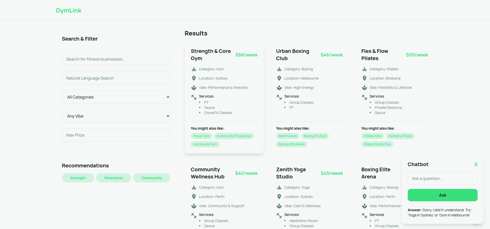

# GymLink Chatbot App


  

- **gymlink-api**: A Laravel-based API to serve the fitness businesses data.
- **gymlink-frontend**: A React.js front-end that consumes the API and displays the businesses, chatbot, and recommendation features.

## Features

- **Search & Filter**: Search for fitness businesses by category, vibe, price, and services.
- **Recommendations**: Get personalized fitness business recommendations based on specific goals (e.g., Strength, Relaxation, Community).
- **Chatbot**: Interact with a chatbot that can filter businesses and provide answers based on natural language queries.
- **Pagination**: Results are paginated to show a limited number of businesses per page.

---

## Prerequisites

Before you begin, make sure you have the following installed:

- **Node.js**: You can download it from [here](https://nodejs.org/).
- **npm** (comes with Node.js) or **yarn** for managing dependencies.
- **PHP** (v8.0 or above) and **Composer** for running the Laravel API.

---

## Installation

### 1. Clone the Repository

Clone both the **backend** (Laravel) and **frontend** (React) projects from this single repository:

```bash
git clone https://github.com/niravpateljoin/gymlink.git
```

### 2. Set Up **gymlink-api** (Laravel)

1. Navigate to the Laravel project folder:

    ```bash
    cd gymlink-api
    ```

2. Install the PHP dependencies using **Composer**:

    ```bash
    composer install
    ```

3. Set up your environment variables:

    - Copy the `.env.example` file to `.env`:

      ```bash
      cp .env.example .env
      ```

4. Generate the application key:

    ```bash
    php artisan key:generate
    ```


5. Serve the Laravel API:

    ```bash
    php artisan serve
    ```

    The API should now be running at `http://localhost:8000`.

---

### 3. Set Up **gymlink-frontend** (React)

1. Navigate to the React project folder:

    ```bash
    cd gymlink-frontend
    ```

2. Install the front-end dependencies:

    ```bash
    npm install
    ```

    or if you're using **yarn**:

    ```bash
    yarn install
    ```

3. Start the React development server:

    ```bash
    npm start
    ```

    or with **yarn**:

    ```bash
    yarn start
    ```

    This will start the React app on `http://localhost:3000`.

---

## Usage

### 1. **Search for Businesses**
- Use the search bar and filter options to search for fitness businesses based on category, vibe, price, and services.

### 2. **Get Recommendations**
- Click on the recommendation buttons (e.g., **Strength**, **Relaxation**, **Community**) to get personalized business suggestions.

### 3. **Chat with the Bot**
- Interact with the chatbot by typing natural language queries like:
  - "Gym in Sydney"
  - "Yoga with sauna"
  - "Pilates in Melbourne"

  The chatbot will filter businesses and return results accordingly.

### 4. **Pagination**
- The results are paginated to display 6 businesses per page. Use the "Prev" and "Next" buttons to navigate through pages.

---

## Technologies Used

- **React**: For building the user interface.
- **Tailwind CSS**: For styling and creating responsive designs.
- **JavaScript (ES6+)**: For app logic and interactivity.
- **Laravel**: For the backend API to serve the businesses data.
- **PHP**: Backend language (Laravel is built with PHP).

---

## Future Improvements

- **Backend Integration**: Connect with a backend API to store and fetch real data.
- **User Authentication**: Add user authentication for saving preferences and history.
- **Better Chatbot**: Improve the chatbot functionality by integrating with an NLP model (e.g., Dialogflow, Rasa).

---
